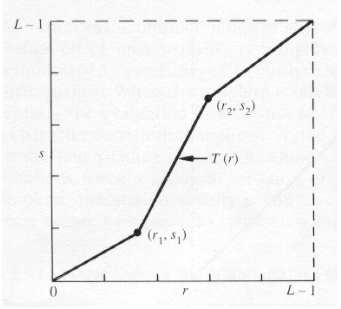
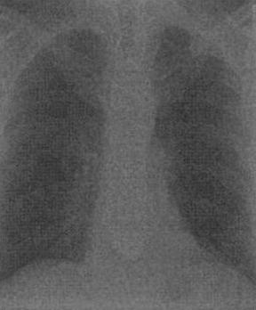
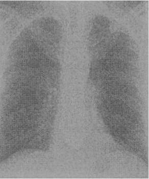
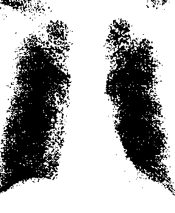

## Contrast Stretching

-----------------------------------------
### Problem Definition:
**Write a program to implement contrast stretching in a digital image.**

Contrast stretching (often called normalization) is a simple image enhancement technique that attempts to improve the contrast in an image by stretching the range of intensity values it contains to span a desired range of values.

    

The locations of (r1,s1) and (r2,s2) control the shape of the transformation function:
* If r1= s1 and r2= s2 the transformation is a linear function and produces no changes.
* If r1=r2, s1=0 and s2=L-1, the transformation becomes a thresholding function that creates a binary image.
* Intermediate values of (r1,s1) and (r2,s2) produce various degrees of spread in the gray levels of the output image, thus affecting its contrast.

Generally, r1≤r2 and s1≤s2 is assumed.

------------------------------------------
### Output:

* Original Image (after grayscaling)

    

    

    

    
    

