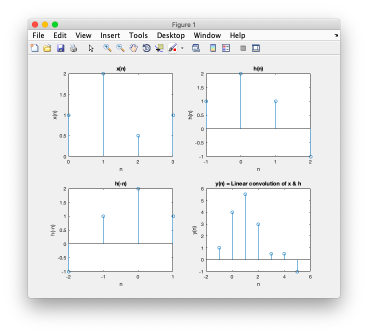

## Convolution

-----------------------------------------
### Problem Definition:
Write a program to compute linear and circular convolution of two discrete time sequences.

------------------------------------------
### Output:

* Linear Convolution

    

    

* Circular Convolution

    

    

