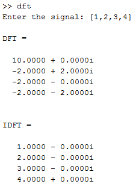

## DFT and IDFT

-----------------------------------------
### Problem Definition:
Write a program to compute the discrete Fourier transform (DFT) and its inverse (IDFT) of a 1-dimensional input (signal) and a 2-dimensional input (image).

------------------------------------------
### Output:

* DFT - 1D

    

* DFT - 2D

    

