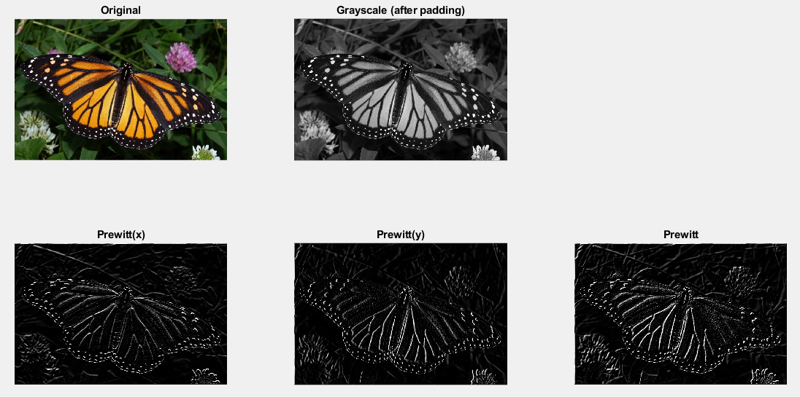
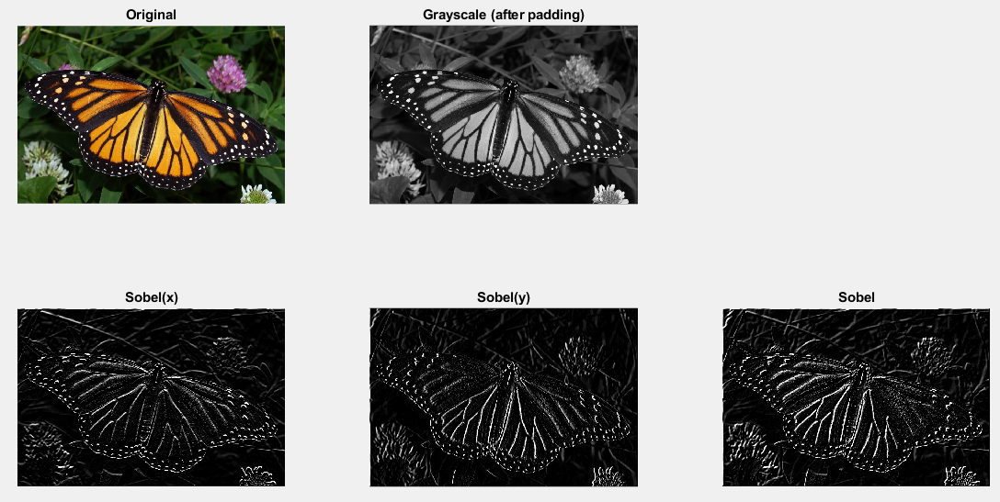
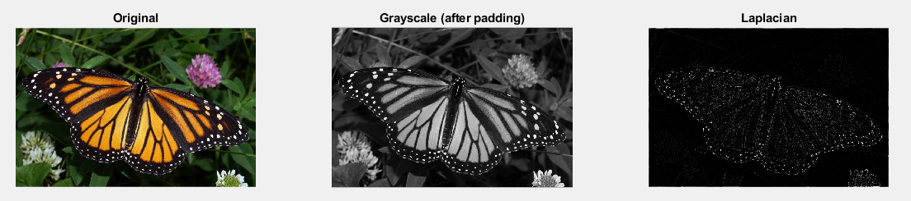

## Edge Detection

-----------------------------------------
### Problem Definition:
Write a program to implement the following edge detection operators: Robert, Prewitt, Sobel, and Laplacian.

------------------------------------------
### Output:

* Robert

    

* Prewitt

    

* Sobel

    

* Laplacian

    

