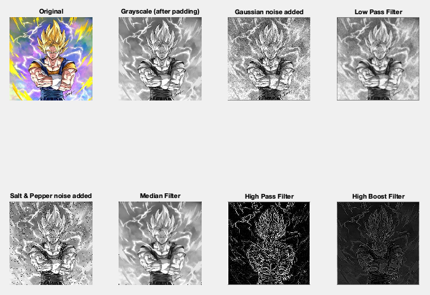

## Low Pass and High Pass Filters

-----------------------------------------
### Problem Definition:
Write a program to implement low pass and high pass filtering in spatial and frequency domain.

------------------------------------------
### Output:

    

