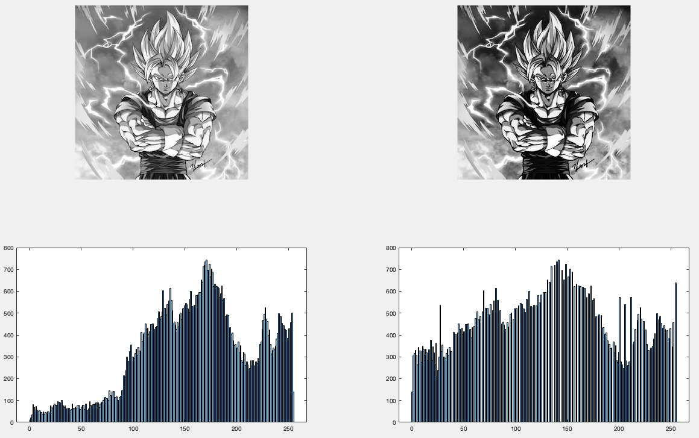
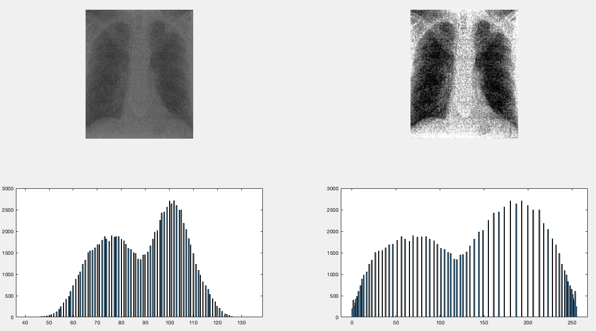

## Histogram Equalization

-----------------------------------------
### Problem Definition:
**Write a program to implement Histogram Equalization.**

In an image processing context, the histogram of an image normally refers to a histogram of the pixel intensity values. This histogram is a graph showing the number of pixels in an image at each different intensity value found in that image. For an 8-bit grayscale image there are 256 different possible intensities, and so the histogram will graphically display 256 numbers showing the distribution of pixels amongst those grayscale values.

A perfect image is one which has an equal number of pixels in all its gray levels. Hence our objective is not only to spread the dynamic range, but also to have equal pixels in all the gray levels. This technique is known as histogram equalization. Basically the histogram equalization spreads out intensity values along the total range of values in order to achieve higher contrast. 

------------------------------------------
### Output:

* Example-1

    

* Example-2

    

