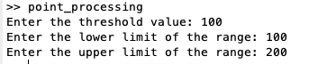
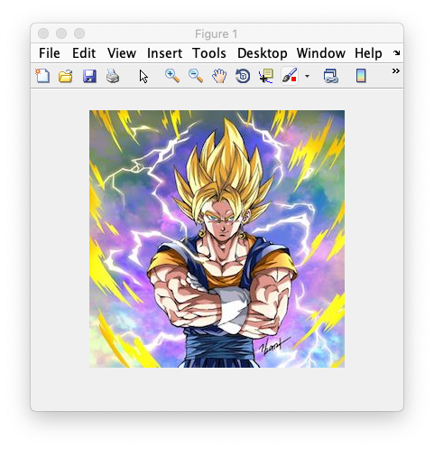
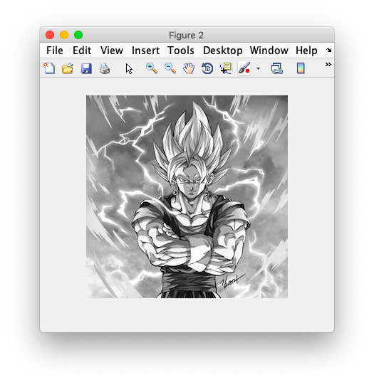
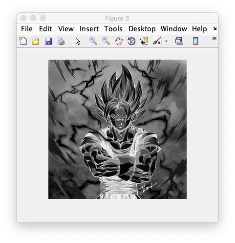
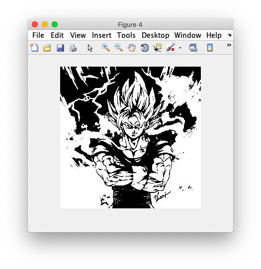
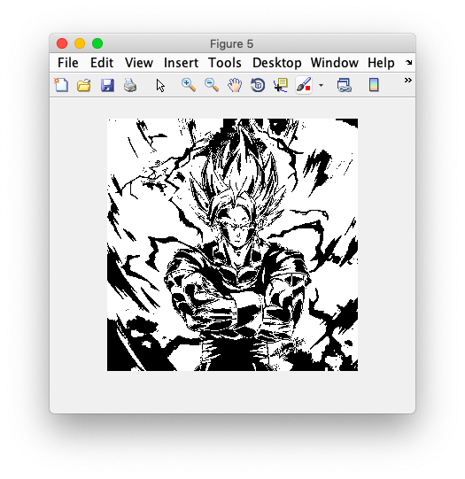
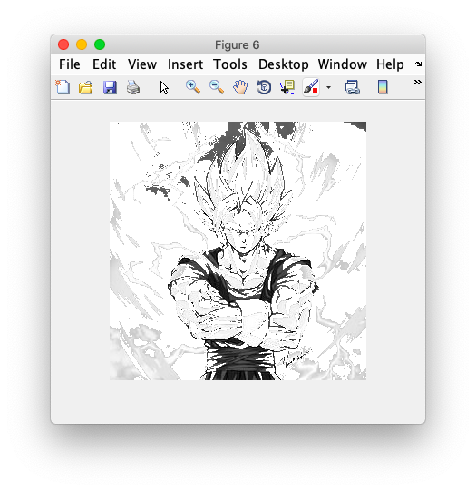
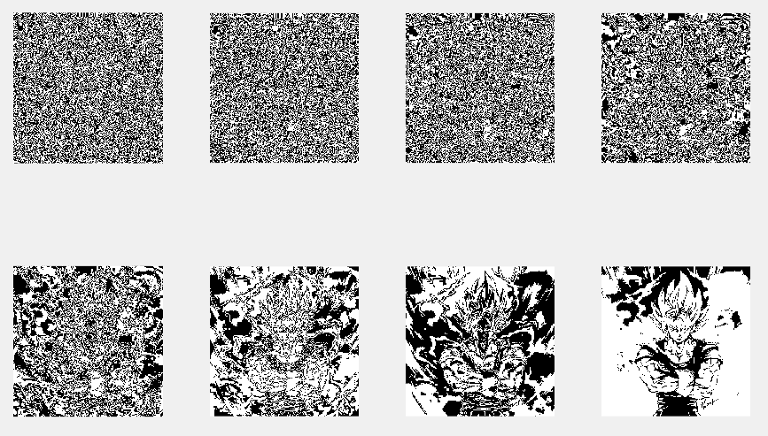

## Point Processing Techniques

-----------------------------------------
### Problem Definition:
Write a program to implement the following point processing techniques in spatial domain:
* Image Negative
* Thresholding
* Gray level slicing
* Bit plane slicing

------------------------------------------
### Output:

    

* Original Image

    

* Grayscale Image

    

* Negation

    

* Thresholding (T=100)

    

* Grayscale Slicing (without background) (Range: 100 to 200)

    

* Grayscale Slicing (with background) (Range: 100 to 200)

    

* Bit Plane Slicing (LSB to MSB)

    

