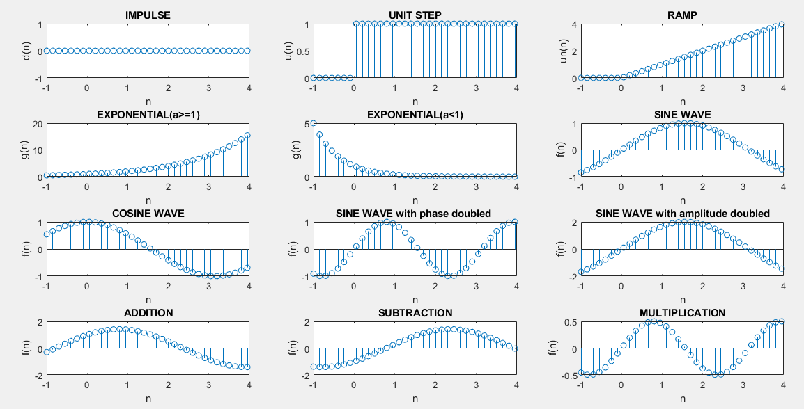
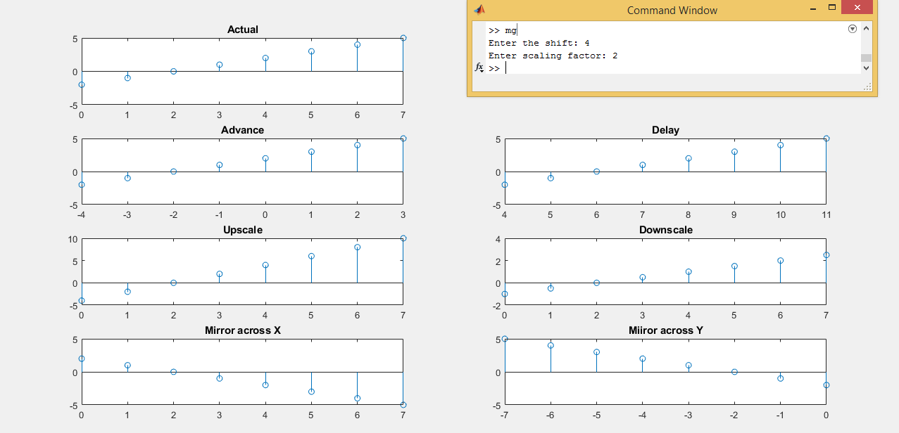
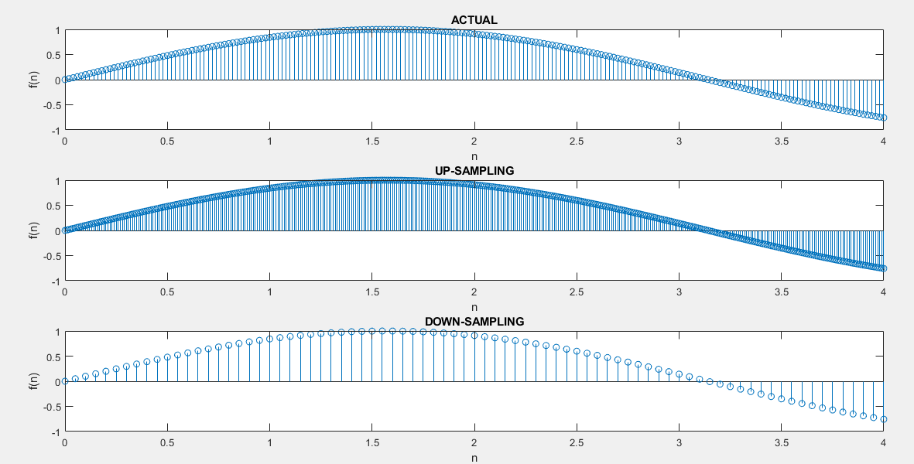

## Contrast Stretching

-----------------------------------------
### Problem Definition:
Write a program to represent standard discrete time signals & perform the following operations on them: 
* Phase change
* Amplitude change
* Addition, Subtraction
* Multiplication
* Shift: Advance and Delay
* Scale: Upscale and Downscale
* Mirror: Across X axis and Y axis
* Sampling: Upsampling and Downsampling

------------------------------------------
### Output:

    

    

    

