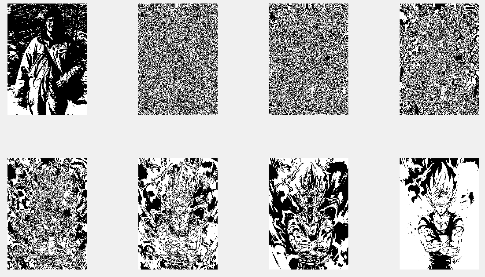

## Steganography

-----------------------------------------
### Problem Definition:
**Write a program to implement implement Steganography using LSB (Least Significant Bit) algorithm.**

* Steganography is the art and science of communicating in a way which hides the existence of the communication. Steganography plays an important role in information security. The term steganography is derived from Greek and literally means “covered writing”. 
* A Steganography system consists of three elements: cover image (which hides the secret message), the secret message and the stego-image (which is the cover object with message embedded inside it).
* In Steganography systems that use an image as the cover, there are several techniques to conceal information inside cover-image. The spatial domain techniques manipulate the cover-image pixel intensity values to embed the secret information. Consequently, the spatial domain techniques are simple and easy to implement. 
* The Least Significant Bit (LSB) is one of the conventional techniques in spatial domain image Steganography. The LSB based image steganography embeds the secret information in the least significant bits of pixel values of the cover image.

------------------------------------------
### Output:

* Original Image (after grayscaling)

    

* Image after contrast stretching with (r1,s1) = (20,50) and (r2,s2) = (100,150) (r2>r1, s2>s1)

    

* Image after contrast stretching with (r1,s1) = (80,0) and (r2,s2) = (80,255) (r1=r2, s1=0, s2=L-1, where L is maximum gray level allowed)

    

* Image after contrast stretching with (r1,s1) = (100,100) and (r2,s2) = (200,200) (r1=s1, r2=s2)

    

* Image after contrast stretching with (r1,s1) = (80,100) and (r2,s2) = (70,80) (r1>s1, r2>s2; possibility of intensity artifacts)

    

* Image after contrast stretching with (r1,s1) = (80,100) and (r2,s2) = (70,80) (r1>s1, r2>s2; possibility of intensity artifacts)

    

* Image after contrast stretching with (r1,s1) = (80,100) and (r2,s2) = (70,80) (r1>s1, r2>s2; possibility of intensity artifacts)

    

